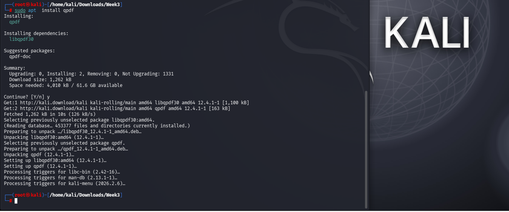

<div align="center">

# 🔐 Networkwalks Week 03 | Password Security Assessment

### Password Cracking • Credential Recovery • PDF Security Analysis • Evidence-Based Validation

<p>


</p>

</div>

**Author:** Chandrashekar Bala  
**Program:** Networkwalks Cybersecurity Internship • Batch B083C  
**Assessment Theme:** Password Security • Offline Credential Recovery • PDF Encryption Analysis • Evidence Correlation

> **Authorized laboratory assessment:** This repository documents an authorized Networkwalks Week 03 password-security assessment. Recovered passwords, crackable hashes, protected source PDFs, decrypted laboratory artifacts, and CTF secrets are intentionally excluded from this public release.

---

## 📌 Executive Summary

Week 03 moved from the external attack-surface work of Week 02 into **controlled password-security assessment and credential-recovery analysis**.

The exercise covered two independent workflows against the supplied laboratory PDF artifacts:

- **W3-PM1 — John the Ripper (JtR)** with a RockYou dictionary workflow
- **W3-PM2 — Networkwalks Hash Calculator + Password Cracker**

The exercise was treated as a security assessment rather than a simple tool demonstration:

```text
Protected PDF
     │
     ▼
Verifier / Hash Extraction
     │
     ▼
Format & Encryption Identification
     │
     ▼
Candidate Generation
     │
     ▼
Offline Verification
     │
     ▼
Credential Recovery
     │
     ▼
Independent Validation
     │
     ▼
Evidence Correlation
     │
     ▼
Security Interpretation
     │
     ▼
Defensive Recommendations
```

### Core analytical result

**Candidate-set coverage materially affected the observed outcome.**

For PDF1, the captured Networkwalks built-in dictionary exhausted without a match, while the broader local RockYou workflow recovered the laboratory artifact. Therefore, a failed bounded dictionary attempt cannot be interpreted as proof that a password is strong or resistant to broader recovery techniques.

---

## 🎯 Assessment Objectives

1. Analyse password-protected PDF artifacts within the authorized laboratory scope.
2. Extract a verifier representation suitable for offline password testing.
3. Validate that the extracted material was recognized by the recovery tooling.
4. Execute controlled dictionary-based recovery.
5. Correlate recovery output with the original protected artifact.
6. Independently validate a recovered credential where practical.
7. Inspect the resulting decrypted artifact for structural/content integrity.
8. Compare two different password-recovery workflows.
9. Document limitations and avoid overstating bounded observations.
10. Translate offensive observations into defensive password-security recommendations.

---

## 🧪 Assessment Scope

| Component | Scope |
|---|---|
| Primary artifacts | Three supplied password-protected PDF laboratory artifacts |
| PM1 | John the Ripper + PDF-specific extraction + RockYou |
| PM2 | Networkwalks Hash Calculator + Password Cracker |
| Recovery model | Dictionary-based offline candidate testing |
| Independent validation | QPDF validation performed for PDF1 |
| Post-recovery inspection | QPDF + Poppler utilities for PDF1 |
| Evidence | Terminal output, browser-tool screenshots, recovery confirmations and validation output |
| Public release | Sanitized methodology, findings and public-safe evidence |
| Authorization | Networkwalks internship/laboratory scope |

---

# 🔬 Technical Workflow

The assessment separated **candidate generation** from **result verification**.

```text
                 ┌───────────────────────┐
                 │   Protected PDF       │
                 └───────────┬───────────┘
                             │
                             ▼
                 ┌───────────────────────┐
                 │ PDF verifier/hash     │
                 │ extraction            │
                 └───────────┬───────────┘
                             │
                             ▼
                 ┌───────────────────────┐
                 │ Format / encryption   │
                 │ recognition           │
                 └───────────┬───────────┘
                             │
              ┌──────────────┴──────────────┐
              ▼                             ▼
       ┌──────────────┐              ┌──────────────┐
       │ JtR +        │              │ Networkwalks │
       │ RockYou      │              │ dictionary   │
       └──────┬───────┘              └──────┬───────┘
              │                             │
              └──────────────┬──────────────┘
                             ▼
                  ┌────────────────────┐
                  │ Recovery result    │
                  └─────────┬──────────┘
                            ▼
                  ┌────────────────────┐
                  │ Independent        │
                  │ validation where   │
                  │ available          │
                  └─────────┬──────────┘
                            ▼
                  ┌────────────────────┐
                  │ Evidence +         │
                  │ security analysis  │
                  └────────────────────┘
```

---

# 🔬 W3-PM1 — John the Ripper

## 📸 PM1 Evidence Preview

<p align="center">
  
  
</p>

<p align="center">
  
  
</p>


## 1. PDF Verifier / Hash Extraction

The protected PDFs were processed using Kali's PDF-specific JtR helper:

```bash
/usr/share/john/pdf2john.pl "My Locked PDF1.pdf" > pdf1.hash
/usr/share/john/pdf2john.pl "My Locked PDF2.pdf" > pdf2.hash
/usr/share/john/pdf2john.pl "My Locked PDF3.pdf" > pdf3.hash
```

The workflow included:

1. Locating `pdf2john.pl`.
2. Extracting a JtR-compatible PDF verifier representation.
3. Confirming that JtR recognized the extracted material.
4. Executing a controlled dictionary attack.
5. Confirming recovery using `john --show`.
6. Performing additional QPDF validation for PDF1.

This is an important distinction: the assessment used the **PDF-specific password-verification representation** rather than treating the encrypted PDF as an arbitrary file for brute-force testing.

---

## 2. Dictionary Attack

The PM1 recovery workflow used the Kali RockYou dictionary:

```bash
john --format=pdf --wordlist=/usr/share/wordlists/rockyou.txt pdf1.hash
john --format=pdf --wordlist=/usr/share/wordlists/rockyou.txt pdf2.hash
john --format=pdf --wordlist=/usr/share/wordlists/rockyou.txt pdf3.hash
```

Recovery state was confirmed with:

```bash
john --format=pdf --show pdf1.hash
john --format=pdf --show pdf2.hash
john --format=pdf --show pdf3.hash
```

### PM1 observed results

| Artifact | JtR outcome | Verification |
|---|---|---|
| PDF1 | Recovered | JtR `--show` + independent QPDF validation |
| PDF2 | Recovered | JtR `--show` |
| PDF3 | Recovered | JtR `--show` |

> **Evidence boundary:** Independent QPDF/decryption validation was performed for PDF1 only. Equivalent QPDF validation is not claimed for PDF2 or PDF3.

---

## 3. PDF1 — Independent QPDF Validation

PDF1 received a second validation path so that the JtR recovery event was not treated as the sole proof of correctness.

The recovered candidate was supplied to QPDF against the original protected PDF:

```bash
qpdf --password='<RECOVERED_VALUE>' --show-encryption "My Locked PDF1.pdf"
```

QPDF accepted the candidate and exposed the PDF encryption configuration, including **AESv2**.

The artifact was then decrypted:

```bash
qpdf --password='<RECOVERED_VALUE>' \\
     --decrypt "My Locked PDF1.pdf" \\
     "My Locked PDF1_decrypted.pdf"
```

The resulting PDF was checked:

```bash
qpdf --check "My Locked PDF1_decrypted.pdf"
```

The decrypted document was subsequently inspected using PDF metadata/image tooling and rendered for visual confirmation.

### PDF1 validation chain

```text
JtR recovery
      ↓
QPDF password acceptance
      ↓
Encryption inspection
      ↓
PDF decryption
      ↓
qpdf --check
      ↓
Metadata / embedded-content inspection
      ↓
Page rendering
```

---

# 🌐 W3-PM2 — Networkwalks Tools

## 📸 PM2 Evidence Preview

<p align="center">
  
  
</p>

<p align="center">
  
  
</p>


The second workflow used the supplied Networkwalks tooling:

```text
Protected PDF
      ↓
Networkwalks Hash Calculator
      ↓
Crackable PDF hash
      ↓
Networkwalks Password Cracker
      ↓
Built-in dictionary
      ↓
┌───────────────┬────────────────┐
│ MATCH         │ EXHAUSTION     │
│               │                │
│ Recovery      │ Bounded        │
│ confirmation  │ negative       │
└───────────────┴────────────────┘
```

The workflow exposed candidate progress and made the relationship between candidate-set coverage and recovery outcome directly observable.

## PM2 Results

| Artifact | Networkwalks result | Interpretation |
|---|---|---|
| **PDF1** | Built-in dictionary exhausted without a match | Bounded negative result; not evidence of password strength |
| **PDF2** | Recovered at candidate 91/100 | Candidate existed within the tested dictionary |
| **PDF3** | Recovered at candidate 35/100 | Candidate existed within the tested dictionary |

### PDF1 — Why the negative result matters

```text
Built-in candidate set
        │
        ▼
No matching candidate
        │
        ▼
Candidate set exhausted
        │
        ✕
        │
        └── NOT proof of strong password
```

The same laboratory artifact was recovered through the broader local RockYou workflow.

Therefore:

> **A bounded dictionary failure establishes only that the tested candidate set did not contain the password under that workflow. It does not establish that the password is strong, unrecoverable, or resistant to broader recovery techniques.**

---

# 🔁 Cross-Workflow Analysis

The objective was **not** to declare one tool universally superior.

The workflows differ in execution model, candidate coverage, visibility and validation capability.

| Dimension | JtR workflow | Networkwalks workflow |
|---|---|---|
| Execution | Local/offline | Browser-based |
| Candidate source | RockYou | Captured built-in dictionary |
| Environment | Kali Linux | Networkwalks interface |
| Candidate coverage | Larger tested corpus | Bounded captured corpus |
| Output | CLI recovery state | Browser progress/result |
| Validation | JtR `--show`; QPDF for PDF1 | Tool recovery confirmation |
| Primary value | Flexible offline recovery workflow | Observable bounded recovery workflow |

### Interpretation

The results are **configuration-dependent observations**, not universal performance benchmarks.

Observed cracking rates are also run-specific. They should not be used as generalized claims about the intrinsic speed or superiority of a tool.

---

# 🧠 Security Findings

## Finding 01 — Encryption does not eliminate password risk

Strong document encryption can coexist with weak practical protection when the password is predictable or readily represented in a candidate set.

```text
Cryptographic protection
        +
Password entropy
        +
Attack cost
        +
Credential handling
        =
Practical security
```

## Finding 02 — Candidate coverage materially affects recovery

Dictionary attacks are bounded by the candidate set.

If:

```text
Password ∉ Candidate Set
        ↓
No dictionary match
```

the result does not establish:

```text
Password = Strong
```

PDF1 directly demonstrated this distinction.

## Finding 03 — Offline verification changes the attack model

Once a usable password-verification representation is available, candidate testing can occur locally without depending on an application's online authentication controls.

This makes the following especially important:

- Password entropy
- Candidate-set coverage
- Verifier protection
- Offline attack cost
- Credential reuse
- Recovery-artifact handling

## Finding 04 — Tool output requires contextual interpretation

Displayed recovery rates depend on execution conditions, including:

- candidate ordering;
- candidate-set size;
- PDF/hash revision;
- implementation;
- CPU/thread configuration;
- system load;
- runtime conditions.

The observed rates in this assessment are therefore treated as **execution evidence**, not benchmark claims.

## Finding 05 — Recovery should be independently corroborated

A recovery engine identifying a candidate is stronger evidence when the candidate is tested against the original protected artifact.

For PDF1:

```text
JtR recovery
   ↓
QPDF password acceptance
   ↓
Successful decryption
   ↓
qpdf --check
   ↓
Content inspection
```

This establishes an evidence chain across independent tooling.

---

# 🛡️ Defensive Recommendations

### 1. Use high-entropy, unique document passwords

Avoid predictable words, common substitutions, reused credentials and recognizable patterns.

### 2. Use password managers

Generate and retain long, unique credentials without relying on human memorization.

### 3. Block common and breached passwords

Password creation/change controls should reject known weak and compromised credentials.

### 4. Protect password-verification material

Extracted hashes, password databases, recovery artifacts and terminal histories should be treated as sensitive security material.

### 5. Apply phishing-resistant MFA where applicable

For account-based systems, MFA adds an independent control when passwords are compromised.

### 6. Monitor authentication abuse

Account defenses should consider password spraying, credential stuffing, repeated authentication failures and anomalous login behavior.

### 7. Validate security controls operationally

Security should be tested against realistic attack paths rather than inferred solely from the presence of encryption or a configured password policy.

---

# 🧾 Evidence Model

The underlying assessment retained evidence across the major workflow stages.

| Evidence class | Purpose |
|---|---|
| JtR version/help | Establish tool and execution context |
| JtR dictionary documentation | Establish attack methodology |
| PDF verifier extraction | Establish PDF-specific extraction |
| RockYou preparation | Establish candidate source |
| JtR recovery output | Establish recovery event |
| JtR `--show` | Establish recovered-state confirmation |
| QPDF validation | Independently test PDF1 candidate |
| QPDF decryption/check | Establish successful access and structural integrity |
| Poppler inspection | Inspect decrypted PDF content |
| Networkwalks hash extraction | Establish PM2 workflow |
| Networkwalks bounded failure | Establish PDF1 candidate-set limitation |
| Networkwalks recovery evidence | Establish PM2 recovery events |
| Public-safe evidence cards | Communicate results without exposing credentials |

See [EVIDENCE_INDEX.md](EVIDENCE_INDEX.md) for the evidence mapping.

---

# 🖼️ Evidence Gallery

> The gallery contains only screenshots verified for the public portfolio package. Credential-bearing and raw-hash screenshots are intentionally excluded.

## 01 — John the Ripper Environment


Establishes the local JtR execution environment and command-line capability context.

## 02 — Dictionary Methodology


Documents dictionary/wordlist operation used in the PM1 workflow.

## 03 — QPDF Tooling



Documents the PDF validation tooling used during the PDF1 verification stage.

## 04 — PDF1 Post-Recovery Inspection


Shows post-decryption inspection and rendering of the recovered PDF1 artifact.

## 05 — Networkwalks Hash Calculator


Shows the browser-based PM2 hash-extraction workflow without publishing the extracted hash.

## 06 — PDF1 Bounded Dictionary Exhaustion


Public-safe evidence showing the built-in dictionary was exhausted without a match. Sensitive hash/credential material is not reproduced in this README.

---

# 📂 Repository Structure

```text
networkwalks-week3-password-security-assessment/
│
├── README.md
├── METHODOLOGY.md
├── RESULTS.md
├── REPRODUCTION.md
├── EVIDENCE_INDEX.md
├── DISCLAIMER.md
├── REPO_INFO.md
├── .gitignore
│
├── docs/
│   └── Week3_Public_Assessment_Summary.pdf
│
└── screenshots/
    ├── E01_PM1_John_the_Ripper_Version_and_Help.png
    ├── E02_PM1_John_Manual_Dictionary_Mode.png
    ├── E06_PM1_QPDF_Installation.png
    ├── E10_PM1_PDF1_Content_Inspection_and_Page_Rendering.png
    ├── E13_PM2_PDF1_Networkwalks_Hash_Calculator_Upload.png
    └── E16_PM2_PDF1_Builtin_Dictionary_Exhausted_No_Match.png
```

---

# 📚 Supporting Documentation

| Document | Purpose |
|---|---|
| [METHODOLOGY.md](METHODOLOGY.md) | Detailed assessment methodology and workflow |
| [RESULTS.md](RESULTS.md) | Sanitized observed results and interpretation |
| [REPRODUCTION.md](REPRODUCTION.md) | Public-safe reproduction workflow |
| [EVIDENCE_INDEX.md](EVIDENCE_INDEX.md) | Evidence-to-claim mapping |
| [DISCLAIMER.md](DISCLAIMER.md) | Authorization and responsible-use boundaries |
| [REPO_INFO.md](REPO_INFO.md) | Repository metadata and portfolio context |
| [Public Assessment PDF](docs/Week3_Public_Assessment_Summary.pdf) | Public-safe technical report |

---

# 🔁 Reproducibility

A professional assessment record should preserve:

```text
Tool Version
     +
Input Artifact
     +
Extraction Method
     +
Hash / Format
     +
Candidate Source
     +
Command / Configuration
     +
Observed Output
     +
Validation Method
     +
Evidence / Timestamp
```

This repository provides the **methodology and sanitized evidence**, not the sensitive laboratory artifacts required to reproduce the actual credential recovery.

For the public-safe workflow, see [REPRODUCTION.md](REPRODUCTION.md).

---

# ⚠️ Public Evidence Hygiene

The following are deliberately excluded:

- recovered passwords;
- raw crackable PDF hashes;
- original locked PDFs;
- decrypted laboratory PDFs;
- credential-bearing terminal histories;
- CTF flags/secrets;
- unnecessary credential-bearing screenshots.

This is intentional portfolio hygiene: the repository demonstrates **assessment capability, methodology, evidence handling and security reasoning** without publishing reusable credential-recovery material.

---

# 🛡️ Responsible Use

This project was performed within the authorized Networkwalks internship/laboratory scope.

Password-recovery techniques must only be applied to systems, documents, accounts or verifier material for which explicit authorization has been granted.

Do not apply these techniques to third-party systems or credentials without permission.

---

# 👤 Author

### Chandrashekar Bala

**Cybersecurity | Security Operations | Threat Intelligence | Security Engineering**

This project is part of my practical cybersecurity portfolio, with emphasis on:

**Offensive Security • Defensive Analysis • Digital Forensics • Threat Research • Evidence-Driven Assessment**

---

## 🔗 Project

**Repository:**  
https://github.com/Chandrashekar-Bala/networkwalks-week3-password-security-assessment

**Program:** Networkwalks Cybersecurity Internship  
**Batch:** B083C  
**Week:** 03  
**Focus:** Password Security Assessment

---

> **Assessment principle:**  
> **Recovering a credential is an event. Proving what happened, validating the result, understanding the limitations, and translating the evidence into defensive action is the assessment.**
