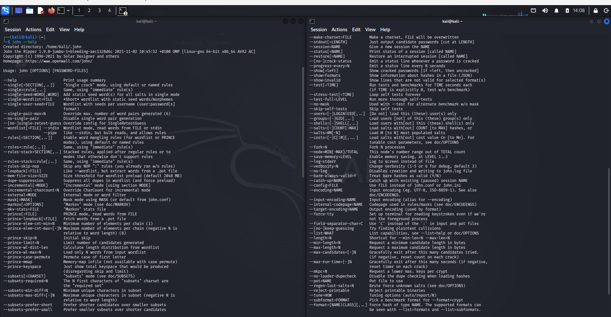
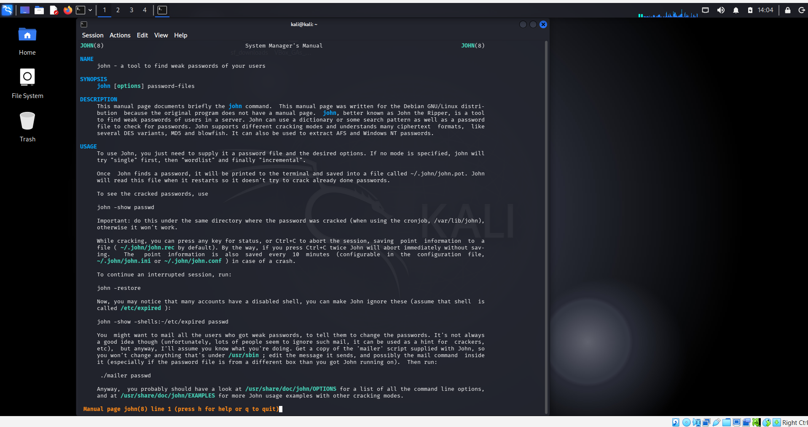
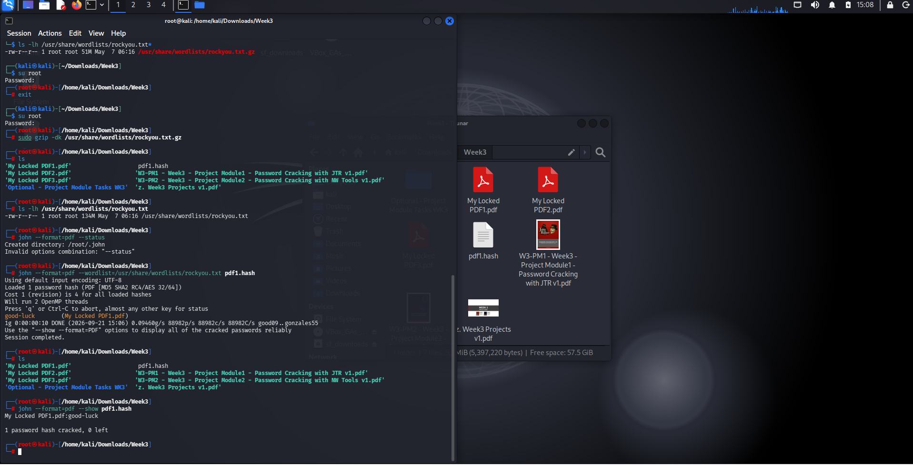
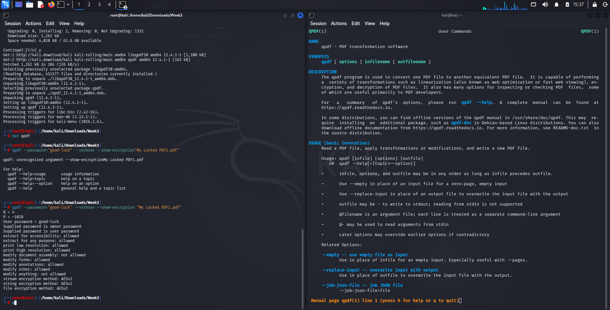
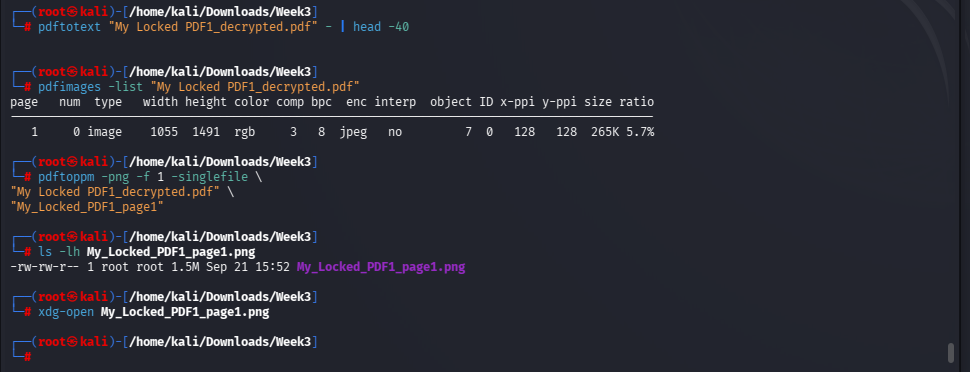
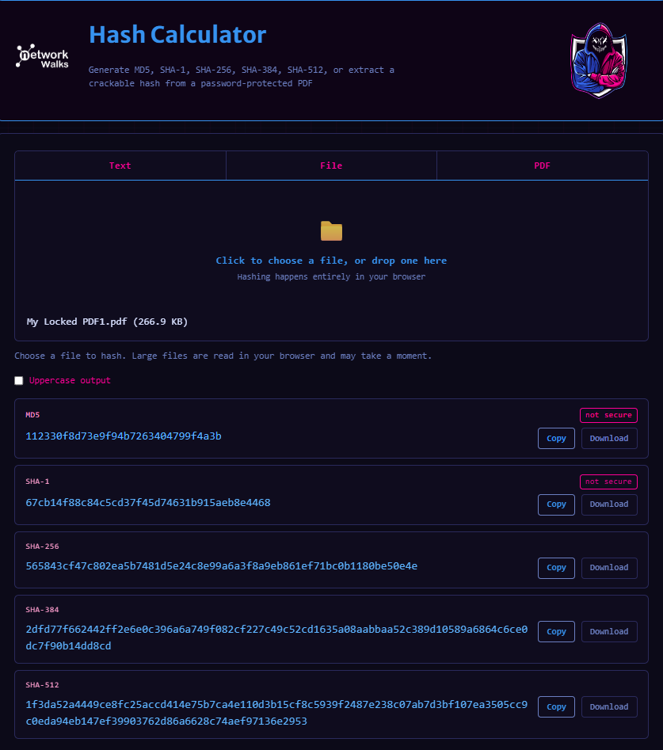
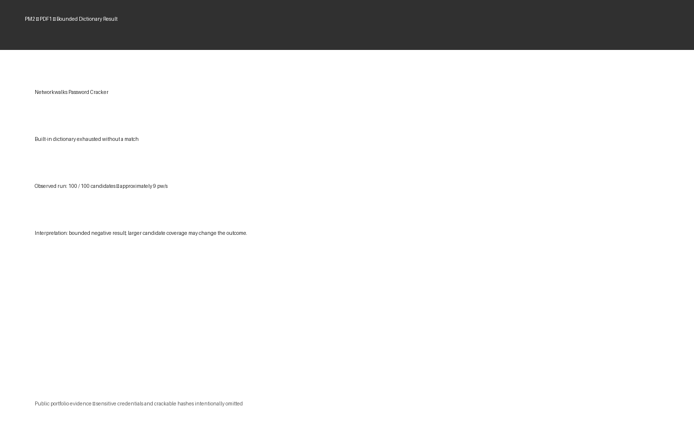
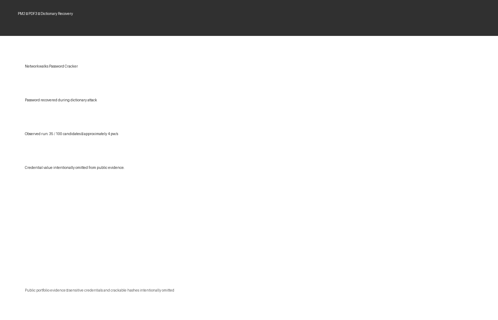

# Week 3 — Password Security Assessment

### Networkwalks Cybersecurity Internship | Batch B083C
**Author:** Chandrashekar Bala

> A controlled password-security assessment covering offline PDF password recovery with **John the Ripper** and browser-based dictionary attacks using **Networkwalks Tools**.

---

## Overview

This project documents Week 3 of my Networkwalks cybersecurity internship. The exercise was performed against the supplied laboratory PDFs within the authorized internship scope.

Rather than treating the task as a simple "run a password cracker" exercise, I approached it as a small assessment workflow:

```text
Protected Artifact
       ↓
Verifier / Hash Extraction
       ↓
Hash / Format Identification
       ↓
Candidate Generation
       ↓
Offline Verification
       ↓
Credential Recovery
       ↓
Independent Validation
       ↓
Security Interpretation
       ↓
Defensive Recommendations
```

The assessment compares two workflows:

- **W3-PM1 — John the Ripper (JtR)** with the RockYou dictionary
- **W3-PM2 — Networkwalks Hash Calculator + Password Cracker** using the captured built-in dictionary workflow

---

## What I Tested

| Artifact | JtR + RockYou | Networkwalks built-in dictionary | Key observation |
|---|---|---|---|
| PDF1 | Recovered | Not recovered in captured run | Candidate-set coverage materially changed the result |
| PDF2 | Recovered | Recovered at 91/100 candidates | Bounded dictionary contained the credential |
| PDF3 | Recovered | Recovered at 35/100 candidates | Bounded dictionary contained the credential |

The most important analytical result is **PDF1**: the browser-based bounded dictionary exhausted without a match, while the larger local RockYou corpus recovered the same laboratory artifact. A failed small dictionary attack therefore cannot be interpreted as proof that a password is strong or uncrackable.

> **Important:** recovered laboratory credentials, crackable hashes, original locked PDFs, and CTF flags are intentionally excluded from this public GitHub package.

---

## Technical Scope

### W3-PM1 — John the Ripper

The local workflow included:

1. Locating `pdf2john.pl` on Kali Linux.
2. Extracting a crackable `$pdf$` representation from the protected PDFs.
3. Validating that JtR recognized the PDF format.
4. Running a controlled RockYou dictionary attack.
5. Confirming recovery with `john --show`.
6. Independently validating PDF1 with `qpdf`.
7. Decrypting and structurally inspecting PDF1.
8. Inspecting the decrypted document with Poppler tooling and rendering the page.

### W3-PM2 — Networkwalks Tools

The browser workflow was:

```text
Locked PDF
   ↓
Networkwalks Hash Calculator
   ↓
Crackable PDF hash
   ↓
Networkwalks Password Cracker
   ↓
Dictionary attack
   ↓
Recovery / bounded negative result
```

The Networkwalks workflow reduces local setup requirements and makes the attack mechanics visible through candidate progress. The assessment also records its limitation: the captured built-in dictionary is bounded, so its failure against PDF1 was not equivalent to a comprehensive password-strength test.

---

## Evidence Highlights

### 1. Local cracking environment



JtR version and command-line capability context from the Kali environment.

### 2. Dictionary methodology



JtR documentation showing dictionary/wordlist operation.

### 3. RockYou preparation



Local RockYou preparation and cracking configuration context.

### 4. Independent PDF validation tooling



qpdf installation/reference evidence used to support independent PDF validation.

### 5. PDF content inspection



Post-recovery inspection of the decrypted PDF and its rendered content.

### 6. Networkwalks workflow



Browser-based hash extraction workflow.

### 7. Public-safe result evidence



PDF1 demonstrates why candidate coverage matters.


PDF2 recovery result with credential material intentionally omitted.



PDF3 recovery result with credential material intentionally omitted.

---

## Technical Findings

### Finding 01 — Offline verification changes the attack model

Once a usable password-verification representation is available, password guesses can be tested locally without relying on the target application's online lockout or rate-limiting controls.

### Finding 02 — Candidate coverage materially affects dictionary attacks

The PDF1 comparison is the clearest demonstration. A bounded built-in dictionary produced no match, while a larger local dictionary recovered the same lab artifact.

### Finding 03 — Tool output needs contextual interpretation

Cracking speed is an execution observation, not a universal benchmark. Hardware, implementation, candidate ordering, dictionary size, and runtime conditions all affect the displayed rate.

### Finding 04 — Recovery should be independently validated

A cracking engine reporting a candidate is stronger evidence when the candidate is subsequently tested against the original protected artifact. PDF1 was independently validated with qpdf in the laboratory workflow.

### Finding 05 — Public evidence needs credential hygiene

A cybersecurity portfolio should demonstrate methodology without publishing recovered passwords, crackable hashes, protected lab files, or unnecessary CTF secrets.

---

## Defensive Recommendations

- Use long, unique passwords or passphrases.
- Block common and breached passwords during password creation/change.
- Store passwords with modern adaptive password hashing, unique salts, and appropriately tuned work factors.
- Use phishing-resistant MFA for privileged and high-value access.
- Prevent credential reuse across organizational systems.
- Treat password-verification material and encrypted documents as sensitive assets.
- Monitor for password spraying, credential stuffing, and anomalous authentication activity.
- Preserve assessment commands, tool versions, wordlists, timestamps, and raw evidence for reproducibility.

---

## Repository Structure

```text
.
├── README.md
├── METHODOLOGY.md
├── RESULTS.md
├── REPRODUCTION.md
├── EVIDENCE_INDEX.md
├── DISCLAIMER.md
├── .gitignore
├── docs/
│   └── Week3_Public_Assessment_Summary.pdf
├── screenshots/
│   ├── E01_...png
│   ├── E02_...png
│   ├── ...
│   └── redacted/
│       ├── E16_..._Public.png
│       ├── E18_..._Public.png
│       └── E20_..._Public.png
└── evidence/
    └── raw_context/   # intentionally empty in the public package
```

---

## Responsible Use

This project documents an authorized cybersecurity internship laboratory. The techniques shown here are intended for systems, files, and environments for which the tester has explicit authorization.

Do not apply password-recovery techniques to accounts, systems, documents, or credentials without permission.

---

## Author

**Chandrashekar Bala**  
Cybersecurity | Security Operations | Threat Intelligence | Security Engineering

This project is part of my practical cybersecurity portfolio and focuses on evidence-driven security testing rather than tool execution alone.
